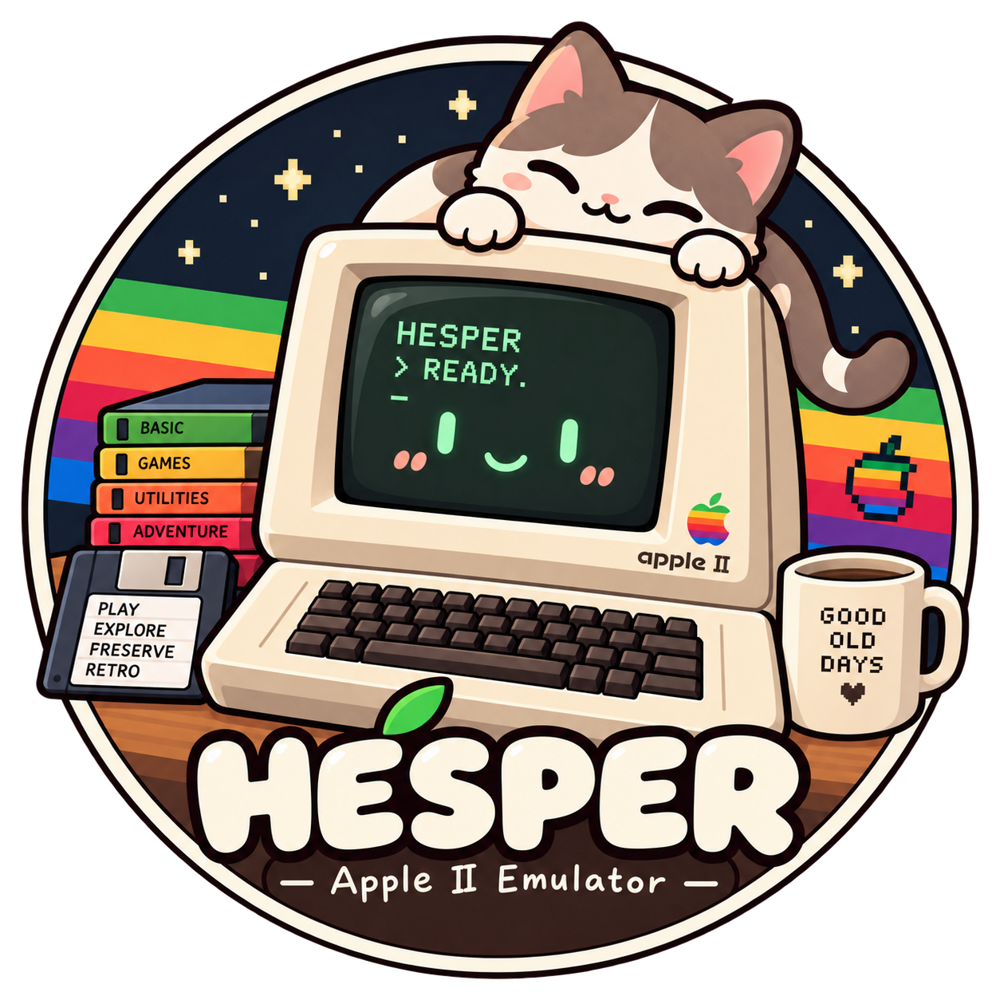

# Hesper

<p align="center">
  
</p>

Hesper 是一个使用 Rust 编写的 NMOS 6502 模拟器项目。目前包含一个机器无关、逐周期执行的 CPU 核心，以及用于演示和验证核心行为的命令行程序。

当前实现聚焦官方 NMOS 6502 指令、总线周期、中断、RDY/SO 和物理 RESET。Apple I 文本系统（Woz Monitor + PIA 键盘/显示）已完成。Apple II 与浏览器前端尚未开始。

## 特性

- 151 个官方 NMOS 6502 opcode
- 单周期与半周期驱动接口
- 可观察的地址、数据、读写方向与 SYNC 总线事件
- IRQ、NMI、BRK、RDY、SO 和物理 RESET 时序
- 二进制及 NMOS 十进制 ADC/SBC
- 外部 `Bus` 接口；CPU 不持有内存或设备
- 无第三方运行时依赖，禁止 `unsafe`
- 有限步数、周期预算和有界诊断 trace

兼容范围不包括非官方 opcode、65C02 或 NES 2A03。Visual6502 对照固定于 revD；通过这些场景不等同于所有 NMOS 修订的硬件认证。

## 快速开始

需要当前稳定版 Rust。仓库中的 `rust-toolchain.toml` 会安装最小工具链及 `rustfmt`、`clippy` 组件。

```sh
cargo run -p hesper
```

内置程序从 RESET 向量启动，将数字 `0..9` 写入 `$0200..$0209`，然后由宿主在完成地址停止。

查看指令或总线 trace：

```sh
cargo run -p hesper -- --trace
cargo run -p hesper -- --bus-trace --trace-limit 4
cargo run -p hesper -- --help
```

Apple I Woz Monitor 交互（需要合法获取 ROM 后）：

```sh
make wozmon                                 # 提取 Woz Monitor ROM 到 wozmon.bin
cargo run -p hesper apple1 --rom wozmon.bin # 启动交互式 Apple I 终端
```

## Workspace 结构

```text
crates/
├── cpu6502/   # NMOS 6502 CPU、Bus/Ram、周期执行器及一致性测试
├── cli/       # 内置演示、Apple I 交互式命令行入口与输出
└── apple1/    # Apple I 机器模型：MC6821 PIA、地址译码 Bus、显示/键盘设备

tools/         # 固定外部数据准备及 Visual6502 重放工具
docs/          # 架构、opcode、路线图、来源和验证记录
```

根目录 Cargo 默认成员是 `crates/cli`。检查整个仓库时必须显式使用 `--workspace`。

## 架构

依赖方向为：

```text
CLI 入口 → 演示宿主 → hesper-cpu6502 → 外部 Bus
```

CPU 核心不负责程序加载、设备所有权、停止条件、日志或展示。宿主持有 `Bus`，并通过 `Cpu::half_cycle`、`Cpu::cycle` 或 `Cpu::step` 驱动执行。

每个执行阶段对应一次真实总线访问。dummy read、RMW 的两次写入、RDY 重读、引脚采样和 RESET 同步都是可观察契约，不能仅按最终寄存器结果简化。

公共 API 由 [`crates/cpu6502/src/lib.rs`](crates/cpu6502/src/lib.rs) 导出。详细行为边界见 [`docs/architecture.md`](docs/architecture.md)。

## 开发与验证

完整的日常本地检查：

```sh
make verify
```

它依次执行格式检查、全目标编译、debug/release 测试、Clippy、CLI smoke run 和 Git 空白检查。也可以单独运行：

```sh
cargo fmt --all -- --check
cargo check --workspace --all-targets
cargo test --workspace
cargo test --workspace --release
cargo clippy --workspace --all-targets -- -D warnings
```

普通 workspace 测试使用仓库内固定夹具，获取 Cargo 依赖后可离线运行。测试包括：

- 本地算术与边界测试
- 672 条固定 SingleStep 样例
- 246 组 IRQ/NMI/RDY/SO revD 总线观察
- 419 组物理 RESET revD 总线观察

## 全量 CPU 一致性验证

全量验证会联网准备固定版本的数据，并运行 151 万条 SingleStep 用例、Klaus 功能/十进制/中断程序、Visual6502 原模型重放和 CPU 引脚对照：

```sh
make data
make full
```

额外需要 Python 3.12+、Node、`make` 和本地 C 编译器。下载及构建结果只写入已忽略的 `.cache/cpu6502/`。

Visual6502 的 Node 重放与 CPU 验证是两项独立证明：

```sh
node tools/verify_visual6502.cjs
cargo test -p hesper-cpu6502 --test pins --release
```

前者证明固定上游模型能重现仓库观察，后者证明 Hesper CPU 与这些观察一致。详细数据来源、哈希、许可证、成功条件和单用例重放命令见 [`crates/cpu6502/tests/data/README.md`](crates/cpu6502/tests/data/README.md)。最新本地执行结果见 [`docs/verification.md`](docs/verification.md) 的最后一节。

## 文档

- [`docs/architecture.md`](docs/architecture.md)：架构、状态、总线和引脚时序契约
- [`docs/opcodes.md`](docs/opcodes.md)：官方 opcode 支持与测试矩阵
- [`docs/roadmap.md`](docs/roadmap.md)：已完成范围与后续里程碑
- [`docs/references.md`](docs/references.md)：硬件资料及外部测试来源
- [`docs/verification.md`](docs/verification.md)：按时间记录的本地验证证据
- [`docs/apple1/examples.md`](docs/apple1/examples.md)：Apple I CLI 与库 API 使用示例
- [`AGENTS.md`](AGENTS.md)：面向代码助手和贡献者的仓库规则
