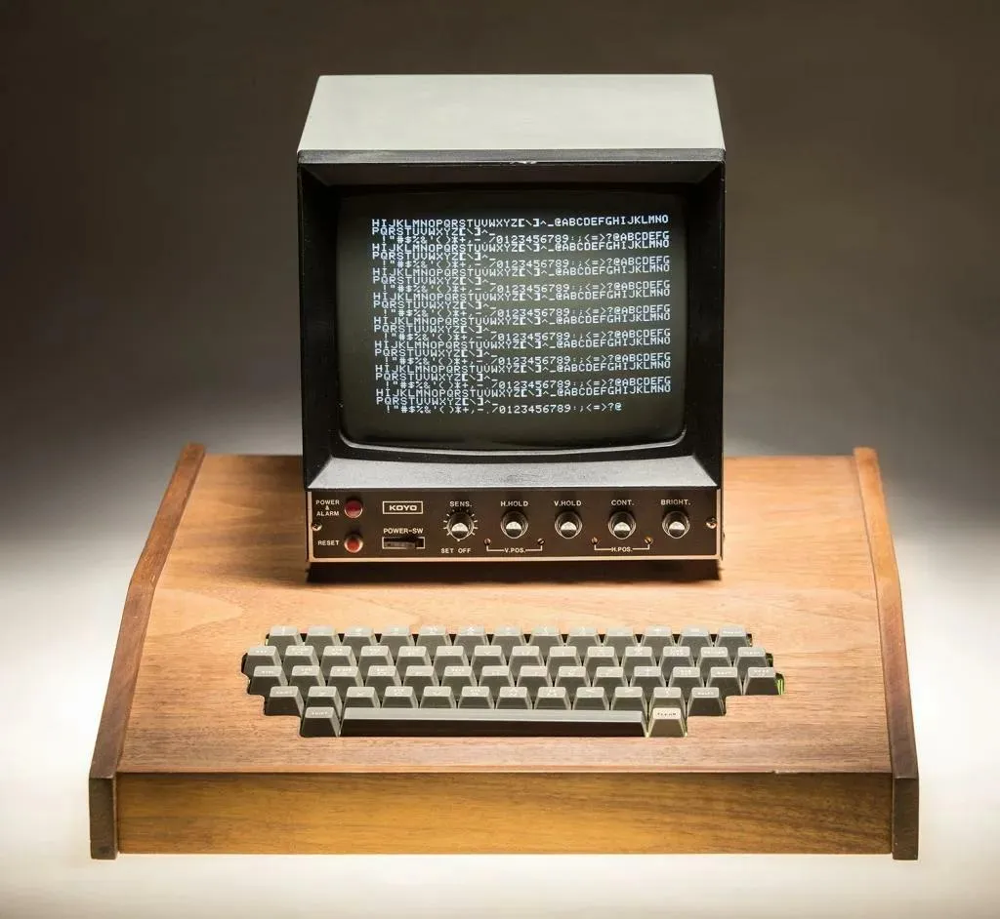
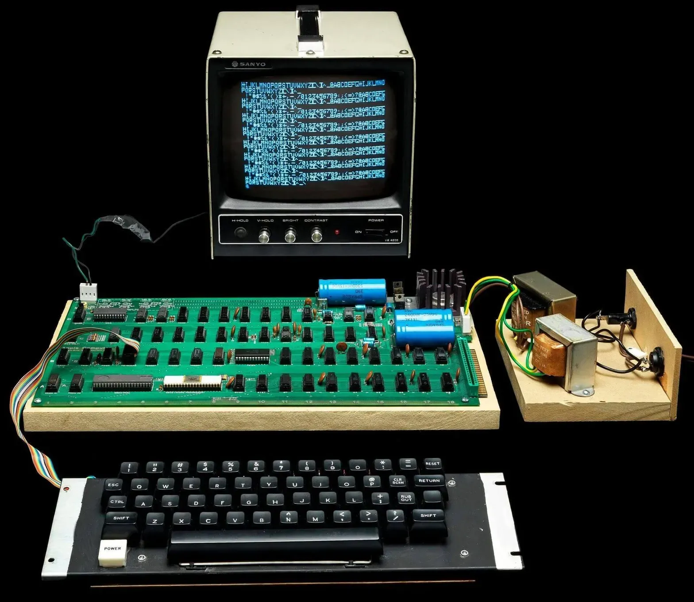

# Apple I 概述

Apple I（Apple Computer 1）是苹果公司的第一款产品，由 Steve Wozniak 设计、Steve Jobs 推动商业化，于 1976 年 4 月在 Homebrew Computer Club 首次展示，同年 7 月以 666.66 美元的价格发售。它出货时只是一块组装好的主板——没有机箱，没有键盘，没有显示器，也没有电源。用户需要自己配上这些外设才能组成一台完整的电脑。



这是一台现代收藏家装配完整的 Apple I 系统：手工木壳、Koyo 品牌的视频监视器和 ASCII 键盘。屏幕上的填充图案是 Apple I 上电后移位寄存器未初始化的典型显示——这种硬件驱动的字符循环在没有按 CLEAR SCREEN 之前会一直持续。

## 起源

1975 年，Wozniak 开始参加 Homebrew Computer Club 的聚会。当时刚出现的 Altair 8800 等微机启发他把微处理器整合进自己正在设计的视频终端——最初他打算用 Motorola 6800，但 175 美元的单价太贵。1975 年底，MOS Technology 以 25 美元推出了 6502，因为指令集架构与 6800 类似，Wozniak 能够直接复用之前的设计，于 1976 年 3 月 1 日基本完成了电路设计。

Wozniak 先向他的雇主 Hewlett-Packard 推荐了这个设计，HP 拒绝了五次。他的本意是把原理图免费分发给 Homebrew 的同好，不是制造或销售。Jobs 在俱乐部看到展示后，意识到商业潜力，说服 Wozniak 合伙成立公司，只卖 PCB 裸板——让爱好者自己买元件焊接。

| 时间 | 事件 |
| --- | --- |
| 1975 年 3 月 | Wozniak 参加 Homebrew Computer Club |
| 1975 年底 | MOS 6502 以 $25 发售，替代过于昂贵的 6800 方案 |
| 1976 年 3 月 1 日 | Wozniak 基本完成电脑设计 |
| 1976 年 4 月 1 日 | Apple Computer 合伙公司成立（Wozniak、Jobs、Ronald Wayne） |
| 1976 年 7 月 | Homebrew Computer Club 展示完全组装的「Apple Computer A」原型 |
| 1976 年 7 月 | Byte Shop 的 Paul Terrell 订购 50 台完全组装好的机器，单价 $500 |
| 1976 年 7 月 | 正式发售，零售价 $666.66（$500 批发价 + 1/3 加价） |
| 1977 年 4 月 | Apple II 推出；Apple I 降价至 $475 |
| 1977 年 10 月 | Apple I 正式停产，从价格表中移除 |

总共生产了大约 **200 台**，其中约 175 台在 9–10 个月内售出。Apple II 推出后，因为 Wozniak 是唯一能回答大多数客户支持问题的人，公司向 Apple I 用户提供折价回收和换购 Apple II 的方案，回收的主板随即销毁——这进一步加剧了存世机器的稀有性。

## 硬件



这张照片展示了 Apple I 的实际硬件组成：主板是唯一由 Apple 提供的部分，左侧的变压器是自行供电方案，键盘是独立的 ASCII 键盘（可见其上方的 RESET 与 CLEAR SCREEN 按钮）。Sanyo 监视器通过复合视频线连接到主板的视频输出端。这种「主板 + 自备外设」正是 1976 年 Apple I 用户的真实使用状态。

### 6502 与时钟

Apple I 使用 **MOS Technology 6502** 微处理器，主频约 **1.023 MHz**。这个看似不规整的时钟频率来自一块 14.31818 MHz 晶振：该频率是 NTSC 彩色副载波（3.579545 MHz）的四倍，再除以 14 得到 CPU 时钟。选用这个频率大幅简化了视频生成电路——因为视频时序本身就锁定在同一个晶振源上。

6502 的直接竞争对手是 Intel 8080 和 Motorola 6800，但 6502 仅售 25 美元（对比 8080 约 179 美元，6800 约 175 美元），同时保持了高效的单周期指令执行能力，指令最短 2 周期、最长 7 周期。

### 内存系统

Apple I 标准配置为 **4 KB DRAM**，使用 16 脚 4096×1 位的动态 RAM 芯片（8 颗组成 4K×8）。主板上预留了插槽，可扩展到 8 KB 或通过添加扩展卡达到最大 64 KB。

主板上的跳线区允许用户将每 4 KB 内存区域指定为 RAM、ROM 或 I/O。最常用的配置是：

| 地址范围 | 大小 | 设备 |
| --- | --- | --- |
| `$0000–$0FFF` | 4 KiB | RAM（系统 RAM 和用户程序空间） |
| `$D010–$D013` | 4 B | MC6820/6821 PIA（键盘 + 显示） |
| `$FF00–$FFFF` | 256 B | Woz Monitor ROM |

`$FFFC–$FFFD` 是 6502 的 RESET 向量，指向 `$FF00`——Woz Monitor 的入口。上电或按下 RESET 按钮后，CPU 从这里开始执行。

未映射的地址空间是**开路总线**——真实硬件上地址线浮空，读取结果不可预测。Apple I 没有 ROM 固件填充整个地址空间的概念。

### 视频显示：移位寄存器终端

Apple I 最大的创新之一是内置了视频显示终端电路，无需昂贵的独立串行终端。用户可以直接将主板连接到一台普通的复合视频监视器或电视机（通过 RF 调制器）。

显示规格非常简洁：

- **40 列 × 24 行**文本（960 个可见字符位）
- 仅支持大写 ASCII 字符、数字和基础标点符号
- 无图形模式，无彩色，无窗口系统
- 字符生成由 **Signetics 2513 64×7×5 字符 ROM** 完成

视频「帧缓冲」不是用普通 RAM 实现的（1976 年的 SRAM 非常昂贵），而是用 **6 颗 Signetics 2504 1024×1 位动态移位寄存器**构成：6 位字符码在其中连续循环移位，数据移位到末端再绕回前端，刚好与电视机的光栅扫描同步。第 7 颗 2504 专门跟踪光标位置。

因为移位寄存器总计 1024 位，而屏幕仅占 960 位（24×40），剩余的 64 个「不可见」位在垂直消隐期间移位通过并被清除。滚屏不是复制任何显存，而是将屏首指针前移 40 个字符——最上面一行移入不可见区并在消隐期间被清空，一个空行从尾部拉入可视区域。

> **终端语义的限制。** 这个视频电路本质上是「玻璃 TTY」（glass teletype）：不是往显存地址写字节来显示字符，而是往输出端口写一个 ASCII 字节，它就出现在下一个光标位置。整个系统只理解一个控制字符：`CR`（Carriage Return，`$0D`）。没有退格、没有光标移动指令、没有 ANSI escape 序列。

典型的输出速率受限于视频帧率：每帧最多写入一个字符，约每秒 60 字符。CPU 在发送下一个字符之前必须轮询显示口的状态标志（`$D012` 的第 7 位），等待移位寄存器准备好接收。

上电时，因为移位寄存器没有硬件清零电路，屏幕会充满不确定图案——通常表现为交替的 `@` 和 `_` 符号，这是移位寄存器 PMOS 动态时钟行为的产物。按下 CLEAR SCREEN 按钮（视频板硬件输入，与 CPU 完全无关）可清屏并将光标移到左上角。

### 键盘与 PIA 握手

Apple I 的键盘与显示通过 **MC6821 Peripheral Interface Adapter（PIA，周边接口适配器）** 连接到 CPU。PIA 是内存映射设备，占 4 个地址：

| 地址 | 寄存器 | 功能 |
| --- | --- | --- |
| `$D010` | 端口 A 数据／数据方向 | 键盘输入（PA0–PA6 = ASCII，bit 7 固定为 1） |
| `$D011` | 控制寄存器 A（CRA） | 键盘状态（bit 7 = 有键，bit 1–0 = 中断边沿选择） |
| `$D012` | 端口 B 数据／数据方向 | 显示输出（bit 7 = 忙标志，bit 6–0 = 字符码） |
| `$D013` | 控制寄存器 B（CRB） | 显示状态（bit 7 = 显示已就绪，bit 1–0 = 中断边沿选择） |

CRA/CRB 的 bit 2 控制数据端口是访问数据方向寄存器还是数据寄存器——这条规则对读和写都适用。只有真正的数据寄存器读才会清除对应端口的中断标志；读 DDR 或控制寄存器以及任何写操作都不会清除中断标志。CR 第 1–0 位选择在 CA1/CB1 上检测哪个跳变边沿来置位中断标志位；第 0 位的中断使能位仅控制是否同时拉低外部 IRQ 输出脚，不影响标志位本身的置位行为。这允许软件在中断关闭的状态下直接轮询标志位——Woz Monitor 用 `BIT $D011` / `BPL` 轮询键盘正是利用了这个特性。

> **Apple I 的 PIA IRQ 输出未连接到 6502 IRQ 引脚。** 所以 Woz Monitor 复位时执行 `CLI`（清除中断屏蔽）后也没有中断真正触发 CPU 中断序列。

Woz Monitor ROM 本身由两片 256×4 位 PROM（并行组成 256×8 位）存储，插在主板的 A1 和 A2 插座中。原理图上标注的型号是 MMI 6301，复刻中常用 Signetics 82S129 等引脚兼容替代品。

### Woz Monitor：256 字节里的操作系统

Apple I 开机后没有操作系统。复位进入的是一个只有 **256 字节**的手写监控程序——**Woz Monitor**（简称 WozMon），由 Wozniak 在 1976 年用纯手工汇编编写，存储在 `$FF00–$FFFF` 的 ROM 中。

#### 启动行为

上电或按下 RESET 后，6502 从 `$FFFC/D` 读取 RESET 向量（`$FF00`），开始执行 ROM 起始处的代码：

```text
D8          CLD           ; 清除十进制模式
58          CLI           ; 清除中断屏蔽
A0 7F       LDY #$7F      ; 设置显示口数据方向（PB7=输入，PB6-0=输出）
8C 12 D0    STY $D012     ; → 写入 Port B DDR
A9 A7       LDA #$A7      ; 控制字：使能中断，CA1/CB1 上升沿有效，输出模式
8D 11 D0    STA $D011     ; → 写入 CRA
8D 13 D0    STA $D013     ; → 写入 CRB
```

随后 WozMon 落入主循环，轮询键盘并解释命令。复位完成后，屏幕上打印一个 `\` 作为提示符——这是 Woz Monitor 的签名。

#### 三种模式

Woz Monitor 有三种工作模式：

| 模式 | 触发方式 | 功能 |
| --- | --- | --- |
| **XAM**（Examine） | 默认模式，地址后接 `.` | 查看内存，每行显示 8 字节 |
| **STOR**（Store） | 地址后接 `:` | 从指定地址开始写入十六进制数据 |
| **BLOCK XAM** | 地址后接 `.` + 另一个地址 | 转储指定范围内的全部字节 |

常用命令：

```text
FF00.FF0F            查看 ROM 前 16 字节
300: A9 C8 20 EF FF 00    在 $0300 写入 5 字节
300R                 从 $0300 开始运行
C100R                跳入磁带接口 ROM（如有 ACI 卡可用）
```

注意 `R` 命令是 **`JMP` 到目标地址**，不是 `JSR`。程序末尾如果直接写 `RTS` 而没有配对的 `JSR`，CPU 会弹出一个不确定的返回地址，Woz Monitor 不会自动收回控制权。要回到 monitor，程序需要显式跳转到 `$FF00`（RESET 入口）或 `$FF1F`（GETLINE 入口，重新打印提示符）。

#### 内部结构

Woz Monitor 使用零页的几个固定位置（`$24–$2B`）保存状态：

| 零页地址 | 变量 | 用途 |
| --- | --- | --- |
| `$24–$25` | `XAML/XAMH` | 当前 examine 地址 |
| `$26–$27` | `STL/STH` | 当前 store 地址 |
| `$28–$29` | `L/H` | 十六进制解析累加值 |
| `$2A` | `YSAV` | 索引保存位置 |
| `$2B` | `MODE` | `$00`=XAM, `$7F`=STOR, `$AE`=BLOCK XAM |

键盘输入缓冲区位于 `$0200–$027F`（128 字节），行末以 CR（`$0D`）标记结束。

#### 关键入口点

ROM 地址是硬编码的一次性熔丝，这些入口点是许多 Apple I 程序复用的软件接口——Woz 有意把它们写成可调用的子程序：

| 地址 | 标签 | 功能 |
| --- | --- | --- |
| `$FF00` | `RESET` | 冷启动入口（CLD/CLI/PIA 初始化/进入主循环） |
| `$FF1F` | `GETLINE` | 输出 CR、显示 `\` 提示、等待输入一行命令 |
| `$FFDC` | `PRBYTE` | 以十六进制输出 A 的值（两个 ASCII 字符） |
| `$FFE5` | `PRHEX` | 输出 A 低 4 位的十六进制数字（一个 ASCII 字符） |
| `$FFEF` | `ECHO` | 等待 `$D012` bit 7 清零（显示就绪），将 A 写入显示口，`RTS` 返回 |

`ECHO` 是使用最广泛的子程序——只要需要向屏幕输出一个字符，就该调用 `$FFEF`：

```asm
        LDA  #'A'+$80       ; Apple I 键盘输出 bit 7 固定为 1
        JSR  $FFEF          ; 等待显示口就绪，输出字符
```

> **bit 7 的约定。** Apple I 键盘发送 ASCII 码时 bit 7 固定为 1。Woz Monitor 的 ECHO 直接把 A 输出到 `$D012`（Port B），而 Port B 的 bit 7 已被 DDR 设为输入。只有 bit 0–6 送到移位寄存器，对应 64 个字符集，屏幕上只显示大写字母、数字和基础标点。WozMon 内部比较也始终使用带 bit 7 的立即数（如 `CMP #'\\'+$80`）。

### 磁带接口与 Integer BASIC

如果只有 Woz Monitor，用户每次开机后必须逐字节手输机器码。Apple 后来推出了可选的扩展卡：

**Apple Cassette Interface（ACI）**

插在主板的扩展槽上，通过普通录音机磁带存储和加载程序：

- ACI 固件也是 256 字节，两片 PROM 放在 `$C100–$C1FF`
- 约 1500 波特，软件定时，使用频率偏移／脉宽调制方式
- 写带时先发送 10 秒的引导头（连续 1 位），然后输出原始内存块
- 原版固件没有错误检测（没有校验和——这个特性是 Apple II 的 ACI 后来加上的）
- 读带结束后打印 `\`，返回 monitor

ACI 随卡附赠了一盘磁带，内含 Wozniak 手写的 **Integer BASIC**（最初就叫 Apple BASIC）。使用流程：

```text
（上电，看到 \ 提示符）
C100R                         ← 跳入磁带接口 ROM
（屏幕上显示 ACI 提示）
E000.EFFFR                    ← 设置加载范围并准备读（不按 Return 先）
（按下磁带播放键）
（按 Return 开始加载）
（约 30 秒后...）
\                             ← 加载完毕，返回 monitor
E000R                         ← 运行 BASIC
>                             ← Integer BASIC 的提示符
```

Integer BASIC 占据 `$E000–$EFFF` 的 4 KB 区间（需要将第二组内存跳线到 `$E000`，基础 4 KB 配置不能直接运行 BASIC）。BASIC 的 `>` 提示符和经典的 `PRINT` / `GOTO` 命令使 Apple I 从「电子爱好者实验板」变成了可以方便编程使用的个人电脑。需要特别指出的是，**Hesper 当前的固定配置（4 KiB RAM 仅映射在 `$0000`）不满足 Integer BASIC 的最低内存需求**；这个限制来自固定的起始 RAM 银行，不是缺失模拟核心功能。

## 历史地位与影响

Apple I 的绝对销量不多（约 200 台），但有几重深远影响：

**1. 键盘 + 屏幕交互范式的确立。**
1976 年的许多微机（如 Altair 8800）靠面板开关输入指令、LED 看结果。Apple I 是第一批出厂就能直接连接键盘和电视机的微机之一——这为后来「终端交互式」个人电脑的普及奠定了基础。

**2. 直接催生了 Apple II。**
Apple I 的销售收入和经验被立刻投入 Apple II 的开发。Apple II 于 1977 年 4 月推出，支持彩色图形、内置键盘、八个扩展槽，后来成为 8 位个人电脑史上最成功的平台之一。没有 Apple I 就没有 Apple II，也就没有后来的 Apple。

**3. 6502 生态系统的早期里程碑。**
Apple I 证明了 6502 可以驱动完整的独立计算机系统。随后 Commodore PET、Atari 2600/8-bit、BBC Micro、NES 等都选择了 6502 家族——这条技术路线贯穿了整个 8 位时代。

**4. 极其珍稀的收藏品。**
存世数量极少的 Apple I 已成为计算机收藏市场的圣杯。近年拍卖纪录：

- 2014 年：Henry Ford 博物馆以 **$905,000** 购入一套含键盘、显示器和配件的完整系统
- 2015 年：一台被遗弃到回收中心的 Apple I 以 **$200,000** 转售
- 2022 年：生产原型以 **$677,196** 拍卖
- 2026 年：验证原型（最终 PCB 量产前版本）以 **$2,750,000** 拍卖

## 在 Hesper 中的 Apple I

本仓库的 `hesper-apple1`（`crates/apple1`）用纯 Rust 实现了 Apple I 的机器模型，配合 CLI 二进制可以直接启动一个交互式的模拟终端。

**模拟范围：**

- 4 KiB RAM、256 字节 Woz Monitor ROM、开路总线
- MC6821 PIA 寄存器模型（DDR、控制寄存器、中断标志、端口数据）
- 40×24 字符屏幕模型（含滚屏、CLEAR SCREEN）
- 键盘 FIFO 输入队列与完整的 CA1 选通脉冲时序
- 逐周期 CPU 推进，`cycles_per_char` 近似移位寄存器就绪时间
- 完整的物理 RESET 信号路径（`set_reset_line`：保持、释放、复位序列完成检测）
- 交互式 raw-mode 终端，支持 Ctrl-R RESET、Ctrl-L 清屏、Ctrl-P 暂停、Ctrl-N 重建机器

**尚未建模的部分：**

- 磁带接口（ACI ROM 与加载／保存协议）
- 扩展内存 Bank（`$E000` 等）——当前固定为 4 KiB RAM 在 `$0000`
- 移位寄存器级精度的视频时序（当前为固定周期近似）
- 显示口实际 ~60 字符／秒的每帧一字符限制（当前 `cycles_per_char` 默认为 1000，约每毫秒一字符）
- RDY 引脚（CPU 层已实现，但 Apple I 当前没有设备驱动此信号）
- 浮空总线的真实噪声行为（当前为确定性最后读取值的模拟约定）

**ROM 不内嵌、不提交。** Woz Monitor 的 256 字节镜像由用户显式通过 `make wozmon` 下载并校验 SHA-256（`e5af0d1c4057bd8e0ef5cb069c208ff7cc0984a7dff53b12c5cf119de8cb5c25`），保存到被 Git 忽略的缓存文件中。普通构建和测试不会自动下载。

本项目已经过 Woz Monitor 敲入短程序并实际运行验证——从 RESET 启动、内存检查、写入 RAM、R 命令执行到输出结果，所有路径均通过真实 CPU 模拟执行，没有修改 ROM 或伪造设备响应。详细使用示例见 [`examples.md`](examples.md)。

## 参考

- *Apple-1 Operation Manual* (1976). 原理图、内存映射与 Woz Monitor 清单。 <https://archive.org/details/Apple-1_Operation_Manual_1976_Apple_a>
- Wikipedia: Apple I. <https://en.wikipedia.org/wiki/Apple_I>
- Shirriff, Ken. "Inside the Apple-1's shift-register memory." <http://www.righto.com/2022/04/inside-apple-1s-shift-register-memory.html>
- "How did the Apple 1 video circuit work?" Retrocomputing Stack Exchange. <https://retrocomputing.stackexchange.com/questions/13228/how-did-the-apple-1-video-circuit-work>
- "Questions about display register." Applefritter. <https://www.applefritter.com/content/questions-about-display-register>
- "Apple 1 start screen." Applefritter. <https://www.applefritter.com/content/apple-1-start-screen>
- Tranter, Jeff. Woz Monitor assembly source. <https://github.com/jefftranter/6502/tree/master/asm/wozmon>
- Tranter, Jeff. "The Apple-1 Cassette Interface." <http://jefftranter.blogspot.com/2012/10/the-apple-1-cassette-interface.html>
- *Preliminary Apple BASIC User's Manual* (October 1976). <https://apple1software.com/downloads/Preliminary_Apple_Basic_Users_Manual.pdf>
- MMI 6301 / Signetics 82S129 PROM datasheets. 256×4 位双极型熔丝 PROM，为 Woz Monitor 与 ACI 固件存储的实际器件。
- 图片：Apple I 原机实拍照片（用户提供）。第一张为木壳完整系统（Koyo 显示器 + 键盘），第二张为主板、独立键盘与电源。
- App "Apple 1" by Tom Owad. `apple1software.com` 提供的二级资料汇总。已用于 ACI 操作程序和 BASIC 加载流程的交叉核验。